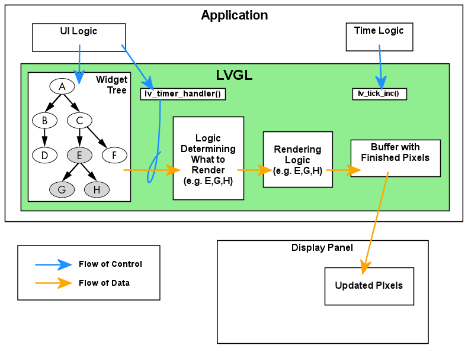
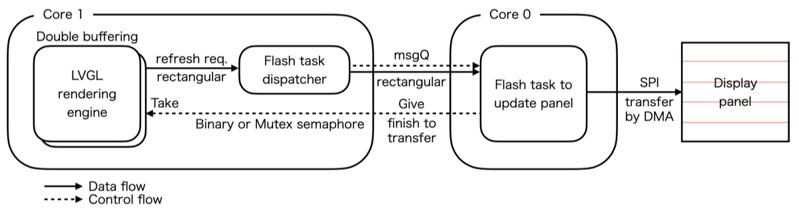
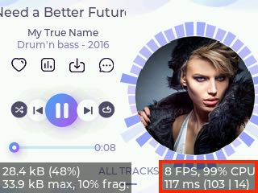
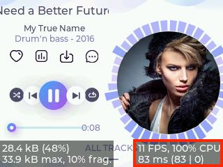

# LVGL_Arduino_FastRendering
Accelerate LVGL rendering with dual-core/multi-threading for ESP32.

## LVGL Rendering

In the section "[Overview of LVGL's Data Flow][1]" of LVGL document, you can find "**Buffer with Finished Pixels**" and "**Updated Pixels**". 

<figure style="text-align: center;">
  
  <figcaption><cite><a href="https://docs.lvgl.io/master/intro/getting_started.html#overview-of-lvgl-s-data-flow" title="Overview of LVGL's Data Flow">Overview of LVGL's Data Flow</a></cite></figcaption>
</figure>

This buffer is defined in the [LVGL_Arduino][2] example sketch as follows:

```c++
/*LVGL draw into this buffer, 1/10 screen size usually works well. The size is in bytes*/
#define DRAW_BUF_SIZE (TFT_HOR_RES * TFT_VER_RES / 10 * (LV_COLOR_DEPTH / 8))
uint32_t draw_buf[DRAW_BUF_SIZE / 4];
```
In this code, the magic number `10` means that one frame is divided into 10 small regions for rendering. The application transfers each rendered region to the display panel.

The following video shows how "**Buffer with Finished Pixels** --> **Updated Pixels**" would be processed.

<p style="text-align: center">
  <video controls muted width="640" height="360">
    <source src="https://embedded-kiddie.github.io/images/2025/04-03/demo-rendering.mp4" type="video/mp4" />
  </video>
</p>

The `10` rectangles in the video are the regions that LVGL has specified to be updated. The border color changes from red to green to blue every frame. Regions that do not change color indicate that no update is necessary.

When scrolling, long rectangular regions are lined up vertically and the entire screen is updated. Meanwhile, when scrolling stops, you can see that only the regions where style has changed are updated.

Dividing a frame into several rectangular regions in this way not only saves memory, but also makes it possible to render in parallel if hardware such as a GPU is available.

### Why `10` ?

In the following thread we can find a deep discussion about CPU/GPU collaboration, CPU software rendering, multi-core parallelization, and the rendering optimization strategies that manage them all.


- [Multi-threaded drawing #3643][3]
- [[multi-threaded-drawing] Discussion about drawing tasks #3700][4]
- [[Parallel rendering] General discussion #4016][5]

From these discussions, we can see that the number 10 was set in terms of the number of renders that can be parallelized on the GPU, the number of CPU cores on various platforms, and reducing heap memory for rendering.

## In case of ESP32

Since the ESP32 must render everything by software, it is expected that the key to realizing an responsive GUI will be not only DMA but also the use of two cores - in particular the number of rectangular divisions and the use of double buffering with parallelization.

### Number of rectangular divisions

For the ESP32, which has only two CPU cores, having more than two threads for rendering makes no sense. Up to two will work in parallel, but the rest will be blocked.

Also, transferring **finished pixels** to the display panel more times means more function call overhead. So a division of 10 might be too large if you don't consider memory space.

However, in practice, a smaller number of divisions results in a larger buffer size for **finished pixels**, which in turn requires more memory.

### Use of double buffering

In section [Flush-Wait Callback][6], `lv_display_set_flush_wait_cb()` is described as follows:

> However with the help of `lv_display_set_flush_wait_cb()` a custom wait callback be set for flushing. **This callback can use a semaphore, mutex, or anything else to optimize waiting for the flush to be completed**. The callback need not call `lv_display_flush_ready()` since the caller takes care of that (clearing the display's flushing flag) when your callback returns.

Based on this explanation, the mechanism of double buffering can be designed as follows:

<p style="text-align: center">
  
</p>

### Experiments

This repository provides three versions for the "ESP32 2432S028R" (aka the Cheap Yellow Display).

```
LVGL_Arduino_FastRendering
│
├── LVGL_Arduino_TFT_eSPI
│   ├── LVGL_Arduino_TFT_eSPI.ino
│   ├── User_Setup.h
│   └── lv_tft_espi.hpp
│
├── LVGL_Arduino_LovyanGFX
│   ├── LVGL_Arduino_LovyanGFX.ino
│   └── LGFX_ESP32_2432S028R_CYD.hpp
│
└── LVGL_Arduino_MultiCore
    ├── LVGL_Arduino_MultiCore.ino
    └── LGFX_ESP32_2432S028R_CYD.hpp
```

- **LVGL_Arduino_TFT_eSPI**  
  To make it work without enabling `LV_USE_TFT_ESPI` in `lv_conf.h`, `lv_tft_espi.cpp` is copied locally as a .hpp file and slightly modified.

- **LVGL_Arduino_LovyanGFX**  
  This is the LovyanGFX version. I prefer LovyanGFX over TFT_eSPI as it is faster and more memory efficient.

-  **LVGL_Arduino_MultiCore**  
  Based on the LovyanGFX version, it utilizes core 0 to take advantage of double buffering.

#### Software Package

| Package                    | Version    |
| -------------------------- | ---------- |
| Arduino IDE                | 2.3.4      |
| ESP32 by Espressif Systems | 3.1.3      |
| LVGL                       | 9.2.2      |
| TFT_eSPI                   | 2.5.43     |
| XPT2046_Touchscreen        | 1.4        |
| LovyanGFX                  | 1.2.0      |

#### Configuration of `lv_conf`

| Section    | Symbol                    |Value| Remarks                             |
| ---------- | ------------------------- |:---:| ----------------------------------- |
| FONT USAGE | `LV_FONT_MONTSERRAT_12`   | 1   | Required for `lv_demo_music()`      |
| ^          | `LV_FONT_MONTSERRAT_14`   | 1   | Defalult                            |
| ^          | `LV_FONT_MONTSERRAT_16`   | 1   | Required for `lv_demo_music()`      |
| OTHERS     | `LV_USE_SYSMON`           | 1   | Required for performance monitoring |
| ^          | `LV_USE_PERF_MONITOR`     | 1   | Show frame rate                     |
| ^          | `LV_USE_MEM_MONITOR`      | 1   | Show memory usage                   |
| DEVICES    | `LV_USE_TFT_ESPI`         | 0   | Prohibit to link code for TFT_eSPI  |
| ^          | `LV_USE_ST7789 `          | 1   | Enable the display driver to use    |
| ^          | `LV_USE_ILI9341`          | 1   | ^ (multiple selections possible)    |
| DEMO USAGE | `LV_USE_DEMO_WIDGETS`     | 1   | Required for `lv_demo_widgets()`    |
| ^          | `LV_USE_DEMO_MUSIC`       | 1   | Required for `lv_demo_music()`      |
| ^          | `LV_DEMO_MUSIC_LANDSCAPE` | 1   | ^                                   |
| ^          | `LV_DEMO_MUSIC_AUTO_PLAY` | 1   | ^                                   |

### Results

<figure style="text-align: center; display: flex;">
  <div style="margin: 0 0.25em 0 auto;">
    <video controls muted width="320" height="240">
      <source src="https://embedded-kiddie.github.io/images/2025/04-10/movie-FPS08.mp4" type="video/mp4" />
    </video>
    <figcaption>Single buffer / 10 divisions</figcaption>
  </div>
  <div style="margin: 0 auto 0 0.25em;">
    <video controls muted width="320" height="240">
      <source src="https://embedded-kiddie.github.io/images/2025/04-10/movie-FPS12.mp4" type="video/mp4" />
    </video>
    <figcaption>Double buffer / 3 divisions</figcaption>
  </div>
</figure>

Looking at the performance figures under heavy load, the average rendering time dropped from 103ms to 83ms, and the average transfer time to the panel dropped from 14ms to virtually zero, resulting in a total average processing time per frame dropping from 117ms to 83ms.

<figure style="text-align: center; display: flex;">
  <div style="margin: 0 auto 0 0.25em;">
    
    <figcaption>Single buffer / 10 divisions</figcaption>
  </div>
  <div style="margin: 0 auto 0 0.25em;">
    
    <figcaption>Double buffer / 3 divisions</figcaption>
  </div>
</figure>

## Conclution

The magic number of 10 strikes a nice balance between parallel rendering using hardware such as a GPU and software rendering using the MCU's multi-core processor.

When creating a real-time application with ESP32, we would likely make full use of both cores.

Furthermore, when adding a GUI with LVGL, it may be able to improve the display throughput by making the magic number as small as the application's memory capacity allows and using the dual cores to apply double buffering.

[1]: https://docs.lvgl.io/master/intro/getting_started.html "Getting Started &mdash; LVGL  documentation"

[2]: https://github.com/lvgl/lvgl/blob/master/examples/arduino/LVGL_Arduino/LVGL_Arduino.ino#L23-L25 "lvgl/examples/arduino/LVGL_Arduino/LVGL_Arduino.ino at master · lvgl/lvgl"

[3]: https://github.com/lvgl/lvgl/issues/3643 "Multi-threaded drawing · Issue #3643 · lvgl/lvgl"

[4]: https://github.com/lvgl/lvgl/issues/3700 "[multi-threaded-drawing] Discussion about drawing tasks · Issue #3700 · lvgl/lvgl"

[5]: https://github.com/lvgl/lvgl/issues/4016 "[Parallel rendering] General discussion · Issue #4016 · lvgl/lvgl"

[6]: https://docs.lvgl.io/master/details/main-modules/display/setup.html#flush-wait-callback "Setting Up Your Display(s) &mdash; LVGL  documentation"
